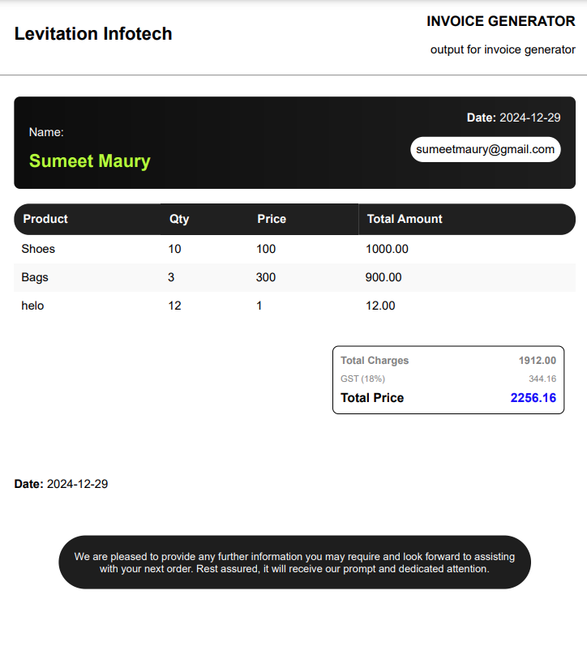

# Invoice Maker Using Vite React Typescript

# Expected Result :


Steps to set up the project
1. Clone the repo
2. Install everything
   ```shell
   npm install
   ```

3. add .env to the folder, and add the follow link
  ```shell
VITE_API_URL=http://localhost:8000
  ```

4. Run the backend by cloning and runing the backend repo (instructions for backend repo are in backend repo)
  ```shell
https://github.com/SumeetMaurya3/InvoiceMakerBackend
  ```

5. Done that's it

